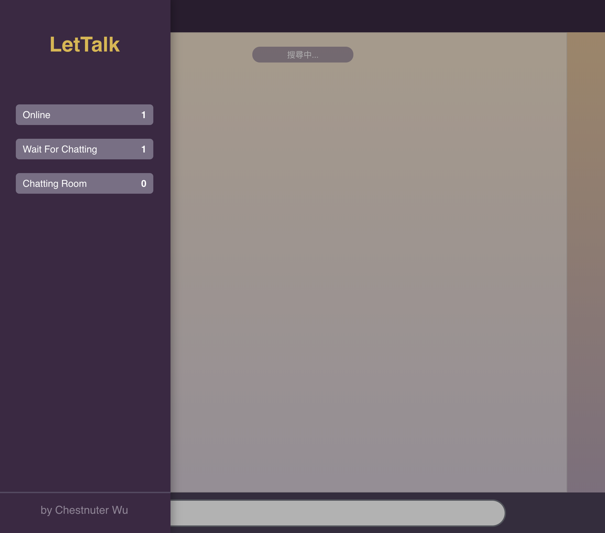
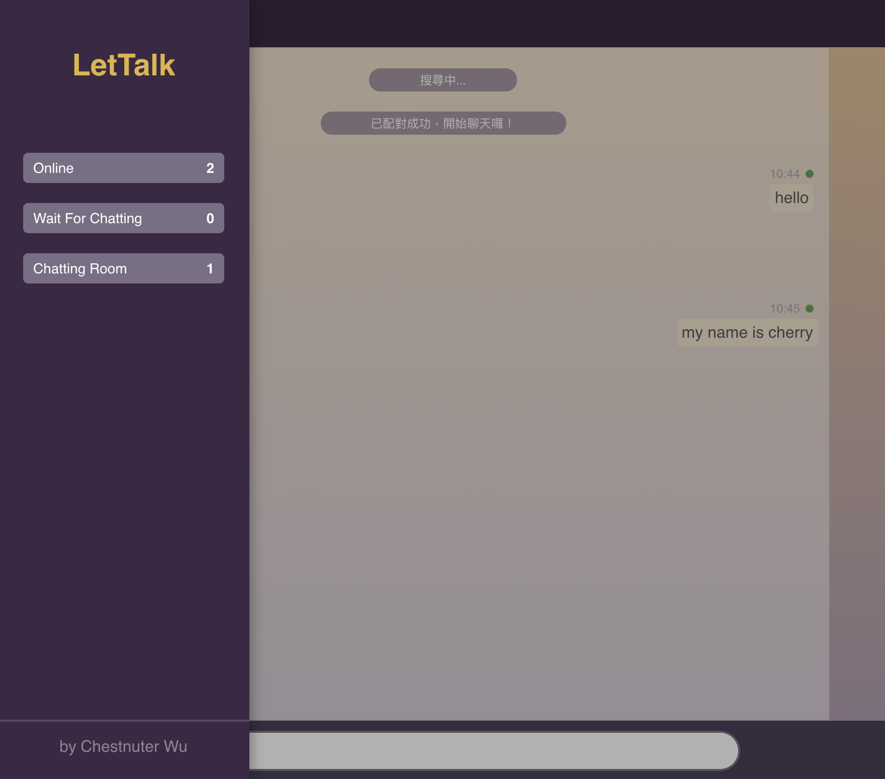
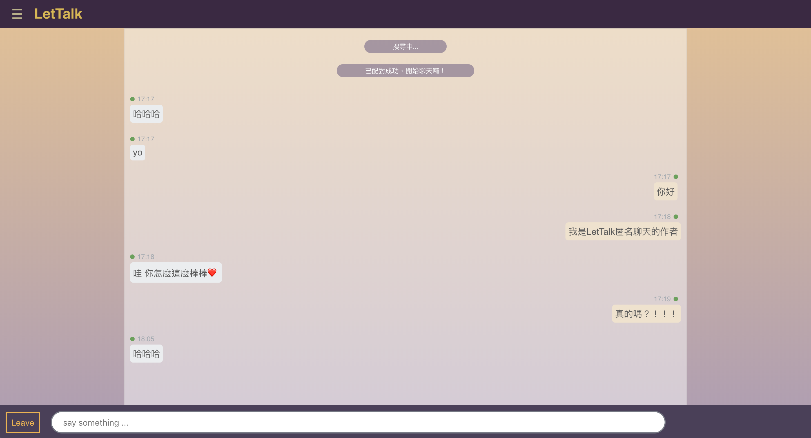
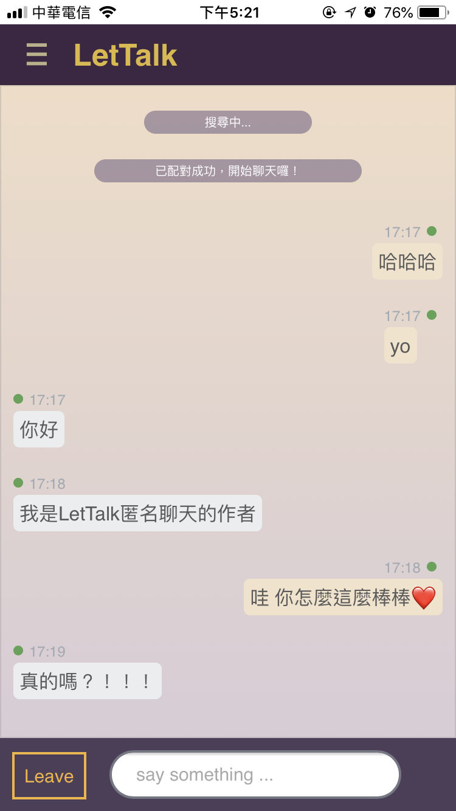

# LetTalk 匿名聊天
### 使用技術
  + 框架：Meteor（node.js全端框架，https://www.meteor.com/）
  + 前端：react.js
  + 切版：scss
  + 資料庫：mongoDB

### 跨平台App
  + 此專案可以build成三種平台- web, ios, android

### 簡介
  + 此專案會為不同使用者搜尋聊天對象，搜尋成功後進行連線聊天，且具備realtime可以即時更新傳送的訊息

### 實作範例
  1. 左側列表統計目前`在線人數`、`等待搜尋數`、`在線聊天室數`
  2. 圖示：搜尋聊天配對
  + 
  3. 圖示：配對成功
  + 
  4. 圖示：聊天中 （此範例web與ios版本進行配對成功）
  +  
  + 

