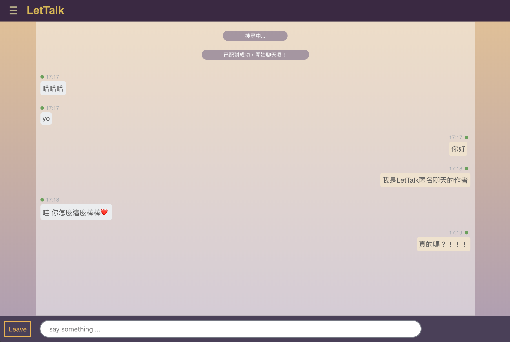
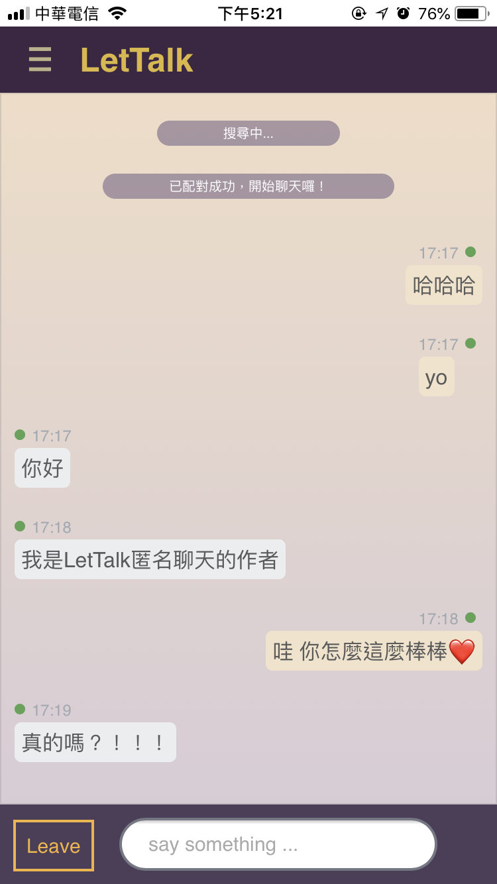

# LetTalk 匿名聊天
+ 使用技術：
  + 框架：Meteor（node.js全端框架，https://www.meteor.com/）
  + 前端：react.js
  + 切版：scss
  + 資料庫：mongoDB

+ 兩種平台使用者搜尋成功後進行連線聊天，且具備realtime可以即時更新傳送的訊息

+ 此專案可以build成三種平台- web, ios, androis

+ 實作範例：
  + web版本
  + 
  + ios版本
  + 

